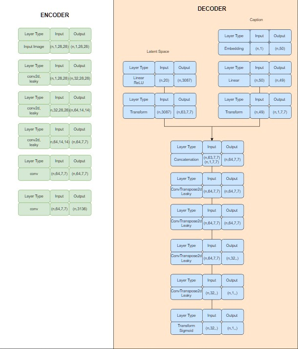
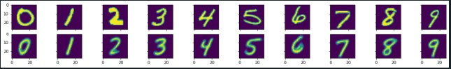

# Welcome to my Autoencoders repo.   
### Here I upload my autoencoder projects with their checkpoints so you can use them 
## Latest projcect: cVAE.py, checkpoint: **cVAE4.pth.tar**
### cVAE model architecure

## Results(reconstructed vs conditioned images):
Trained for 150 epochs, LR = 0.0008, b1= 0.5, b2= 0.99  

