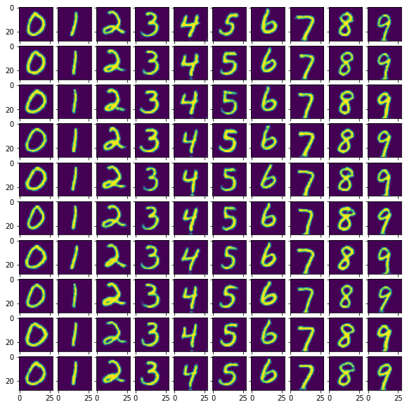

## Welcome to my GAN projects. 
Currently working on creating a simple GAN capable of producting images from MNIST dataset  
Code was developed on Spyder and split on blocks, may look weird on other editors

# Projects info:
### Main folder
1. **GAN.ipynb** - Used for experimenting
2. **cond_gan_pytorch.py/ipynb** - Conditional image generating model 
3. **cond_gan(int)_pytorch.py/ipynb** - Conditional image generating models with caption inpterpolation(their checkpoint files are not compatible with non-interpolated caption)

### /checkpoint_files
1. **cond_gan_pytorch/gan_pytorch** - for simple model
2. **cond_gan_pytorch6/10** - for interpolated model architecture
3. **leNet** - used in cond(int)_evaluate to load leNet model

### Sample Images from cGAN Model:

